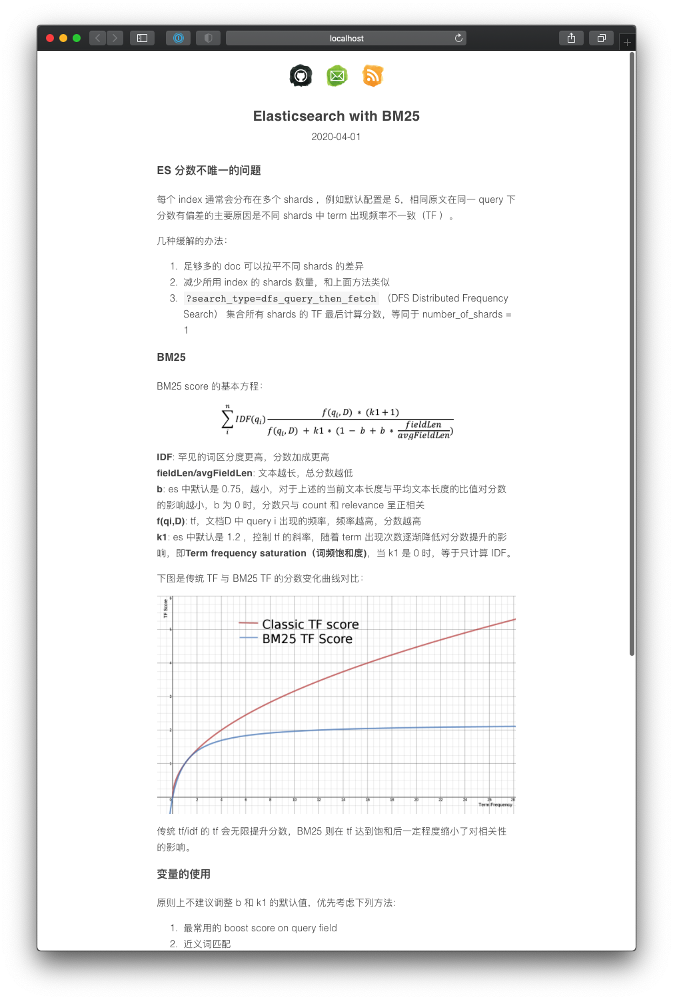

# hexo-theme-adoubi

another simple hexo theme. [online demo](http://sinux.me)

## Installation

hexo-theme-adoubi developed with hexo 3.2

plugin dependencies:

- hexo-renderer-pug
- hexo-generator-feed

clone theme

    git clone https://github.com/shinux/hexo-theme-adoubi.git themes/adoubi

modify site config

    theme: adoubi

upgrade

    cd themes/adoubi
    git pull origin master

## Upgrade Logs

v0.0.2 May 12 2017:

- remove big-black-dirty-ugly header and personal logo.
- make feed icon more hidden.
- hide post date on list page.

## Copyright

resources usage:

- Myriad font
- normalize.css

Keep `Theme By Adoubi , Powered By Hexo.` in footer and do whatever you want.
